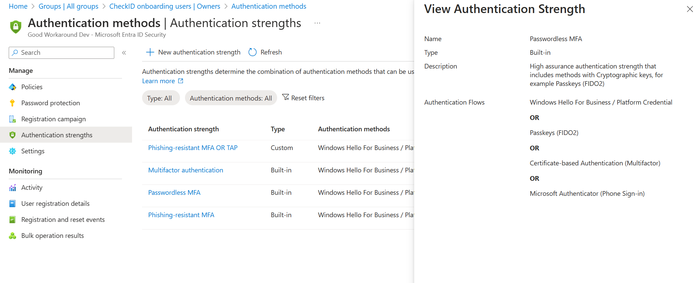
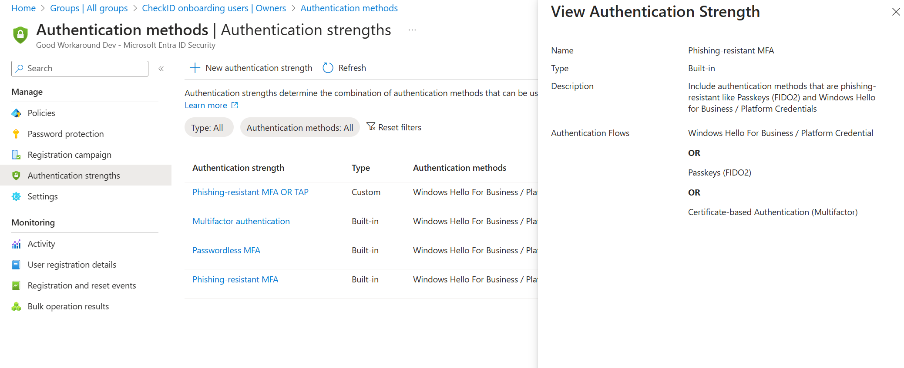

# Authentication strength

>
> This is only necessary if you have policies requiring either **Passwordless MFA** or **Phising resistant MFA**
>

For any organization that has policies that requires users to satisfy the built-in authentication strength **Passwordless MFA** or **Phising resistant MFA**, you'll notice that neither of these includes **Temporary Access Pass**:

This means that a **Temporary Access Pass** will not be able to satisfy the policies and the onboarding will fail. To fix this, you have some options, [as documented by Microsoft](https://learn.microsoft.com/en-us/entra/identity/authentication/how-to-support-authenticator-passkey#workarounds-for-an-authentication-strength-conditional-access-policy-loop).

In summary, you have these options:

- For **mobile devices**, create a **separate conditional access policy** that requires a **custom authentication strength** that allows **Temporary Access Pass**
- Use the [Onboarding Group feature](Onboarding-Group.md) to temporary add users to an Entra ID group during onboarding, and use this group to exclude the user from the passwordless or phishing resistant MFA requirement.