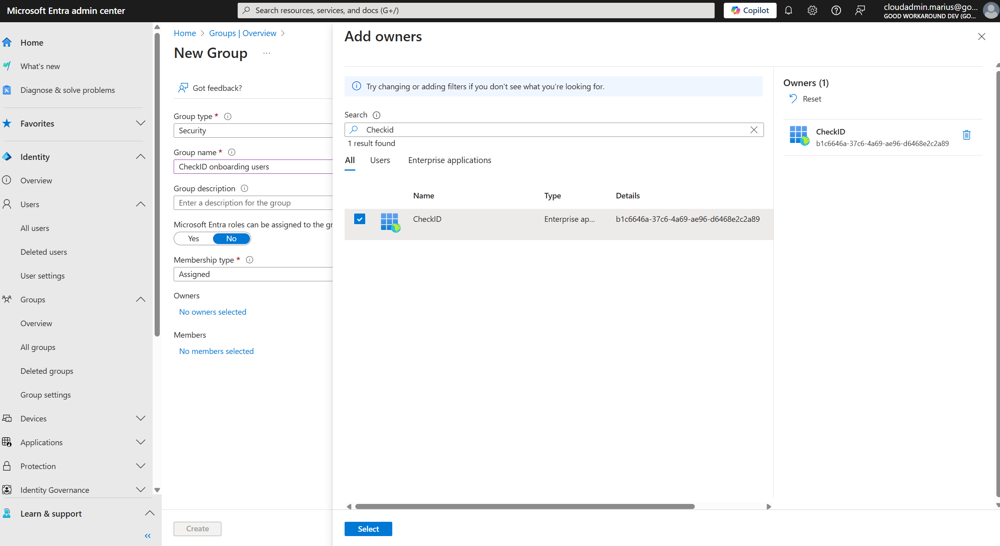
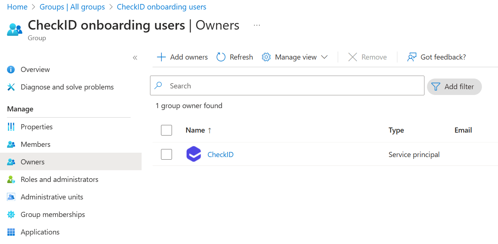

# Onboarding Group

CheckID supports temporarily adding the user that is onboarding to an Entra ID security group that can be used for the purpose of excluding the onboarding user from a conditional access policy.

To configure such as group, go to the [**Entra portal**](https://entra.microsoft.com), **Groups** and **Overview**.

Click **New group**, give it a name and make sure the **CheckID** Enterprise App is added as the owner of the group:

It should now look like this:

After you have created your group, please notify your CheckID contact person with the **object id** of the group, and we will enable the feature for you.

After this, you will see that users that completes the onboarding are added to the group for one hour during the onboarding, before the user is removed again.
