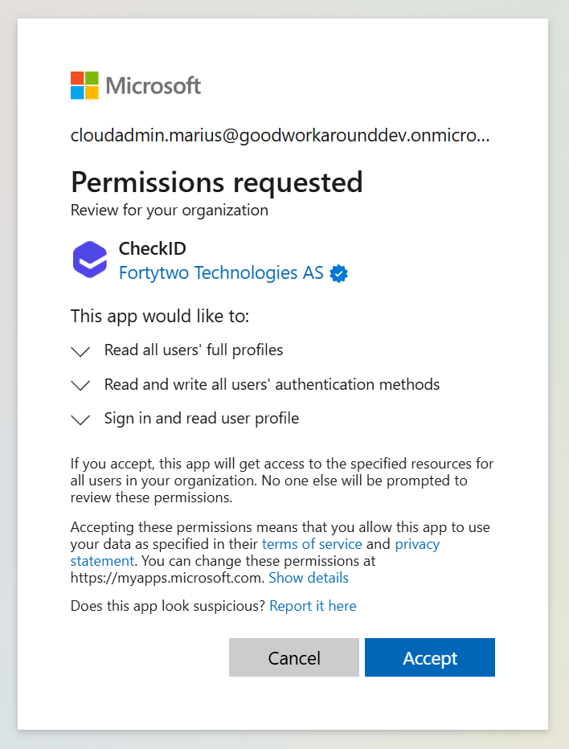
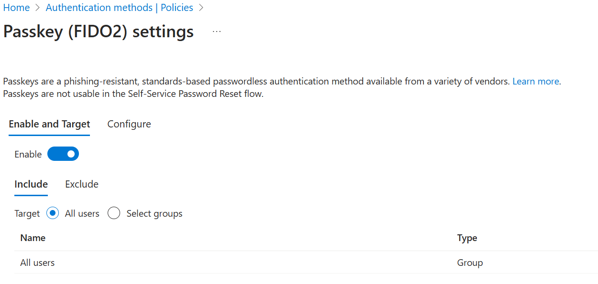
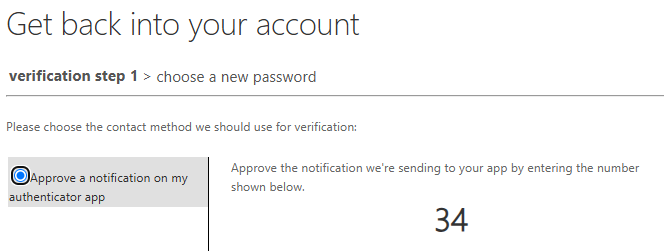
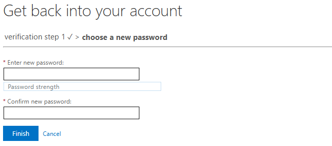
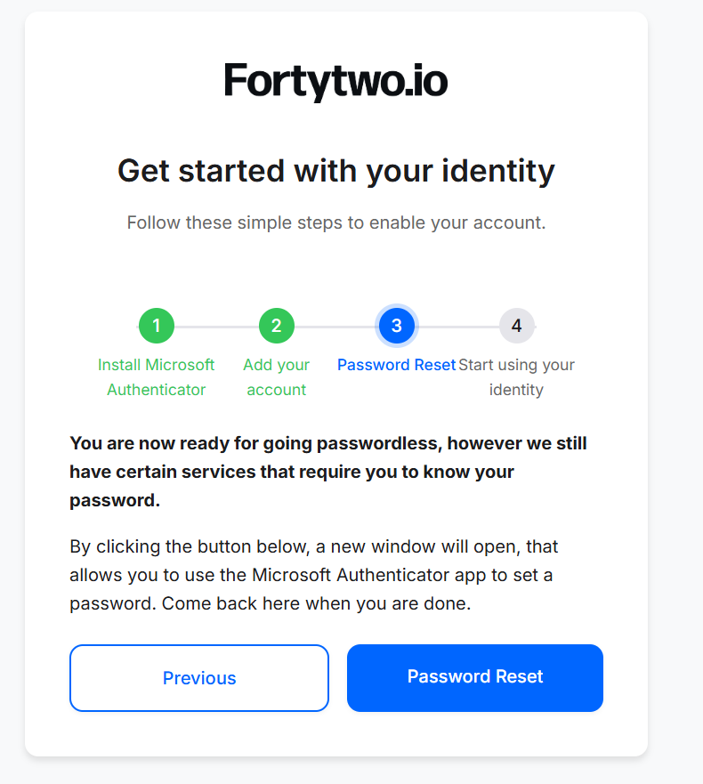

## Configure Consent and Entra ID Settings

To allow CheckID to function correctly, you'll need to configure a few settings in Microsoft Entra ID.

## Step 1 – Consent to the CheckID Application

As a **Global Administrator**, you need to provide tenant-wide admin consent for the CheckID app.

Visit the following URL to review and approve the necessary permissions:

<https://login.microsoftonline.com/common/adminConsent?client_id=b1c6646a-37c6-4a69-ae96-d6468e2c2a89>

### Permissions requested

| Permission | Why it’s needed |
|------------|------------------|
| [**User.Read.All**](https://learn.microsoft.com/en-us/graph/permissions-reference#userreadall) | Allows CheckID to locate and read user account details in your tenant |
| [**UserAuthenticationMethod.ReadWrite.All**](https://learn.microsoft.com/en-us/graph/permissions-reference#userauthenticationmethodreadwriteall) | Allows CheckID to create a Temporary Access Pass (TAP) for users |
| [**CustomSecAttributeAssignment.Read.All**](https://learn.microsoft.com/en-us/graph/permissions-reference#customsecattributeassignmentreadall) | Enables CheckID to read custom attribute assignments. This permission has no effect unless the CheckID service principal is explicitly assigned the **Attribute assignment reader** role in Microsoft Entra. |

## Step 2 - Configure the recommended Conditional Access policies

> **Note:** This step is only relevant if you have conditional access policies that requires **phishing resistant MFA** or **passwordless MFA** as authentication strength, or requires **app protection policies** or **approved apps** only.

We have several recommended configurations, depending on your situation. There are two "issues" we need to handle during onboarding, which is [app protection](Conditional-Access/Require-Approved-Or-Protected-App-Policy.md) and [authentication strength](Conditional-Access/Authentication-Strength.md). To support the Microsoft recommended approaches, with temporarily exempting the user from certain conditional access policy requirements, CheckID has two features available:

- Automatic maintenance of an Entra ID security group for onboarding users
- Calling a webhook with information about the user doing the onboarding, where the target webhook can do the same thing as the previous feature (adding a person temporary to a group)

## Step 3 - Configure Temporary Access Pass and Passkeys

For onboarding users, we get users to register the Microsoft Authenticator app using a [Temporary Access Pass](https://learn.microsoft.com/en-us/entra/identity/authentication/howto-authentication-temporary-access-pass), while getting a passkey enrolled at the same time. This means that the feature Temporary Access Pass and Passkey must be enabled in the tenant.

In the [**Entra portal**](https://entra.microsoft.com/#home), open **Protection** and **Authentication methods**.

Configure **Passkey (FIDO2)** to **target all users** with the below configuration:

Configure **Temporary Access Pass** to **target all users** with the below configuration:

## Step 4 - "We also need users to have a password"

CheckID prepares you for being passwordless, but we also understand that many of our customers still need their users to have a password. This can because computers are still hybrid joined, or because they need to sign into Active Directory integrated services that do not do single sign-on.

To provide users with the ability to set a password, our approarch uses [Entra ID password write-back](https://learn.microsoft.com/en-us/entra/identity/authentication/tutorial-enable-sspr-writeback) and an Entra ID authentication methods configuration that allows the [Microsoft self service password reset](https://passwordreset.microsoftonline.com/) functionality to be used with only the authenticator app.

This allows the user to set a password without knowing the user account's existing password and any requirement for "change on next logon" etc.

During our user onboarding experience, you can choose whether to show instructions for your users to establish a password, or skip and hide this step.

