# Password Agent Installation Guide

The Check ID password agent module is a simple module made for listening to change password requests from CheckID, executing the password change in the local Active Directory (AD) and reporting back the status of the password change. There are a few steps required to install the module and run it:

## Requirements

- The agent must be running on a domain joined windows server
- [PowerShell 7.5 or newer installed](https://learn.microsoft.com/powershell/scripting/install/installing-powershell-on-windows#msi)
- AD PowerShell installed, with all features: ```Install-WindowsFeature -Name RSAT-AD-Tools -IncludeAllSubFeature```

## Step 1 - Install required PowerShell modules

Open a PowerShell 7 window (pwsh.exe) as **administrator** and install the required modules from PowerShell Gallery:

```PowerShell
Install-Module EntraIDAccessToken -Scope AllUsers
Install-Module Fortytwo.CheckID.PasswordAgent -Scope AllUsers
```

>**Note!**
>
>You may be prompted to confirm the installation from 'PSGallery'.
>
>Enter '**A**' to allow current, and all future, modules from PSGallery to be installed, without prompting  
>
>Enter '**Y**' to allow installation of only current module

***Untrusted repository***  
*You are installing the modules from an untrusted repository.*  
*If you trust this repository, change its InstallationPolicy value by running the Set-PSRepository cmdlet.*.
*Are you sure you want to install the modules from 'PSGallery'?*  
*[**Y**] Yes  [**A**] Yes to All  [N] No  [L] No to All  [S] Suspend  [?] Help (default is "N"):*

>**Note!**
>
>If modules cannot be installed from PowerShell Gallery they must be downloaded manually into the checkid folder (created in [Step 2](#step-2---configure-checkidpasswordagent-requirements)).
>
>Files downloaded from the internet can be tagged with script execution block, for security reasons.
>To remove this protection, and make sure all files in the checkid folder can be processed, run the following:  
>
>```Get-ChildItem -Recurse c:\checkid | Unblock-File -WhatIf```
>
>If it looks OK, run again without *-WhatIf*:  
>
>```Get-ChildItem -Recurse c:\checkid | Unblock-File -Verbose```

## Step 2 - Configure CheckIDPasswordAgent requirements

1. Run the following (also as **administrator**):

```PowerShell
# Create checkid directory and go into the new folder
mkdir c:\checkid ; cd c:\checkid

# Create new Windows event log source "CheckIDPasswordAgent" visible in Application event log
New-EventLog -LogName "Application" -Source "CheckIDPasswordAgent"

# Creates and saves a self-signed certificate named "CheckIDAgent" used for authenticating with password reset API
$Certificate = New-SelfSignedCertificate -Subject "CheckIDAgent" -NotAfter (Get-Date).AddYears(100)
[System.Convert]::ToBase64String($Certificate.Export([System.Security.Cryptography.X509Certificates.X509ContentType]::Cert), "InsertLineBreaks") | Set-Content -Path "CheckIDAgent-$($env:COMPUTERNAME).cer"

# Output thumbprint, certificate file name and agent id, required to configure the CheckID password agent run script
"","Thumbprint:       $($Certificate.ThumbPrint)", "Certificate file: CheckIDAgent-$($env:COMPUTERNAME).cer","Agent id:         $(New-Guid)","" | Write-Host
```

PowerShell will generate output (example below).
Copy it and save it as you'll be needing this later on to configure and run the CheckID Agent.

```md
Thumbprint:       905A03B4EBF6B25E7986B6E0C20172F74988C373
Certificate file: CheckIDAgent-<SERVERNAME>.cer
Agent id:         a628f707-6c25-596e-8424-4249fa0e14b9
```

## Step 3 - Consent to Fortytwo Universe (our API) and create an Entra app registration for the password reset agent

1. As a **global administrator**, admin consent the Fortytwo Universe API: [https://login.microsoftonline.com/common/adminconsent?client_id=2808f963-7bba-4e66-9eee-82d0b178f408](https://login.microsoftonline.com/common/adminconsent?client_id=2808f963-7bba-4e66-9eee-82d0b178f408)  
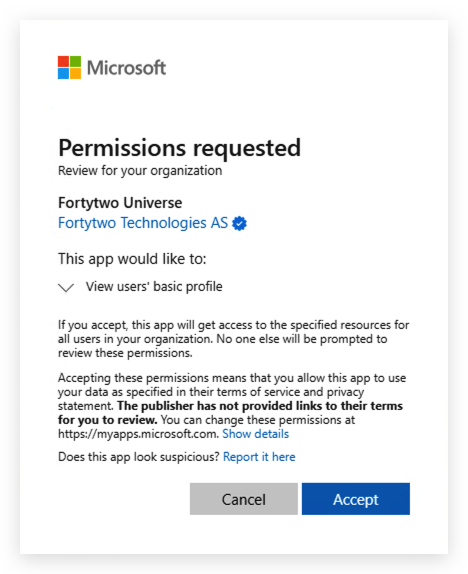

    >**Note!**
    >
    >After **successfully** granting admin consent you may get an error page.
    >This simply means that there is no redirect URI configured on the app registration.
    >The admin consent process is complete.
    >
    >To verify that the admin consent was successful, look in **Enterprise applications**:
    >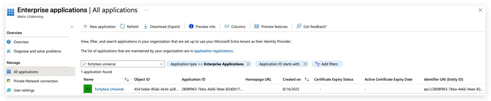

1. As a **Cloud Application Administrator** (or more privileged admin), in **Entra ID**, go to **App registrations** and select **New registration**

1. Give it a name (e.g. *CheckIDAgent*) and select **Register**

1. Copy and save the **Client ID** and **Tenant ID**


1. Under **Certificates & secrets**, upload the certificate file created in [***Step 2***](#step-2---configure-checkidpasswordagent-requirements)
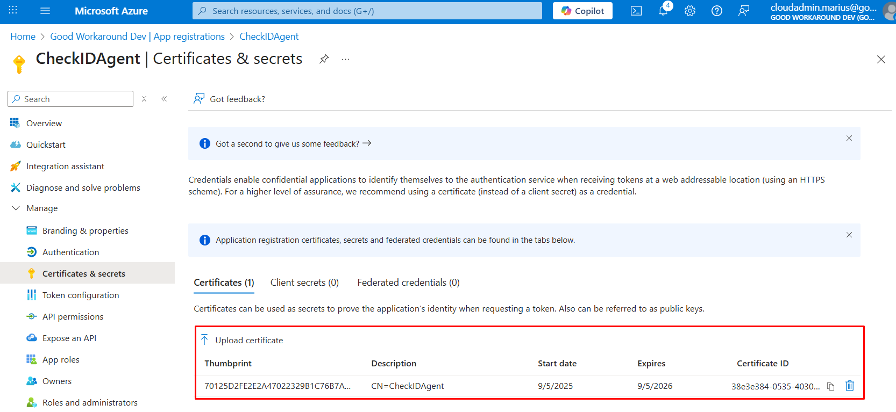

1. Under **API permissions**, click **Add a permission**, select **APIs my organization uses** and locate **Fortytwo Universe**


1. Under **Application permissions**, check **checkid_agent.all** and click **Add permissions**
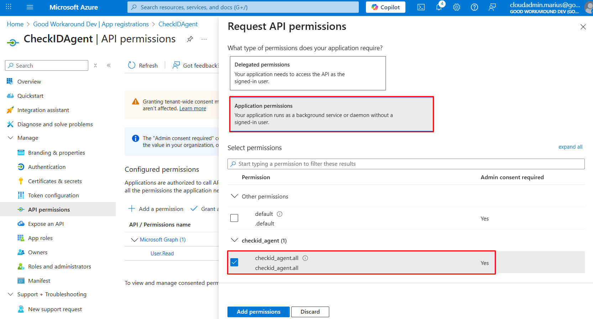

1. Select **Grant admin consent**


## Step 4 - Create a run file to test the CheckID Agent configuration

Create a new PowerShell file ```C:\checkid\run.ps1```.
Replace placeholder values (for thumbprint, clientid, tenantid) with output from [Step 2 - Configure CheckIDPasswordAgent requirements](#step-2---configure-checkidpasswordagent-requirements):

```PowerShell
# Install and auto update the PasswordAgent module
Install-Module Fortytwo.CheckID.PasswordAgent -Confirm:$false -Force -Verbose -Scope CurrentUser
Import-Module Fortytwo.CheckID.PasswordAgent -Force

Add-EntraIDClientCertificateAccessTokenProfile `
    -Resource "2808f963-7bba-4e66-9eee-82d0b178f408" `
    -Thumbprint "THUMBPRINT_FROM_STEP2" `
    -ClientId "CLIENT_ID_FROM_STEP3" `
    -TenantId "TENANT_ID_FROM_STEP3"

Connect-CheckIDPasswordAgent `
    -AgentID "AGENTID_FROM_STEP2" `
    -Verbose

Start-CheckIDPasswordAgentListener -Sleep 2 -Verbose -Debug
```

## Step 5 - Test the CheckID Agent manually

1. Open a PowerShell 7 window (pwsh.exe) as **administrator**

1. Run: ```cd c:\checkid ; . c:\checkid\run.ps1```

    At this point, you can test out CheckID and see that a password change is received by the agent.

    >**Note!**
    >
    >The reset password operation will only be successful if your user holds sufficient Active Directory privileges

    If the agent starts successfully it will create output similar like this:

    ```md
    VERBOSE: Generating RSA key pair for encryption
    VERBOSE: Registering CheckIDPasswordAgent with AgentID a628f707-6c25-596e-8424-4249fa0e14b9 and TenantID b1fa17-9118-43ed-107e-1be368b7d2b0 to api.fortytwo.io
    VERBOSE: Requested HTTP/1.1 POST with 603-byte payload
    VERBOSE: Received HTTP/1.1 response of content type application/json of unknown size
    VERBOSE: CheckIDPasswordAgent registered successfully: {"agentId":"a628f707-6c25-596e-8424-4249fa0e14b9"}
    VERBOSE: Starting CheckIDPasswordAgent listener with a sleep interval of 2 seconds
    VERBOSE: Requested HTTP/1.1 GET with 0-byte payload
    VERBOSE: Received HTTP/1.1 response of content type application/json of unknown size
    VERBOSE: Content encoding: utf-8
    VERBOSE: No requests found for agent a628f707-6c25-596e-8424-4249fa0e14b9
    VERBOSE: No requests found, sleeping for 2 seconds
    VERBOSE: Requested HTTP/1.1 GET with 0-byte payload
    VERBOSE: Received HTTP/1.1 response of content type application/json of unknown size
    VERBOSE: Content encoding: utf-8
    VERBOSE: No requests found for agent a628f707-6c25-596e-8424-4249fa0e14b9
    VERBOSE: No requests found, sleeping for 2 seconds
    ```

    ### PowerShell Execution Policy

    >**Note**!
    >
    >You may get stopped by strict ***script execution policy***.
    >
    >To run the script, temporarily modify current execution policy:
    >
    >```PowerShell
    >Get-ExecutionPolicy -List
    >$originalExecutionPolicy = Get-ExecutionPolicy -Scope CurrentUser
    >Set-ExecutionPolicy -ExecutionPolicy RemoteSigned -Scope CurrentUser -Force
    >```
    >
    >When you have verified that the CheckID Agent can run successfully, set execution policy back to it's original setting:
    >
    >```PowerShell
    >Set-ExecutionPolicy -ExecutionPolicy $originalExecutionPolicy -Scope CurrentUser -Force
    >```

1. Open Event Viewer, expand Windows Logs and look into Application event log.
   There should now be logs with source **CheckIDPasswordAgent**.
   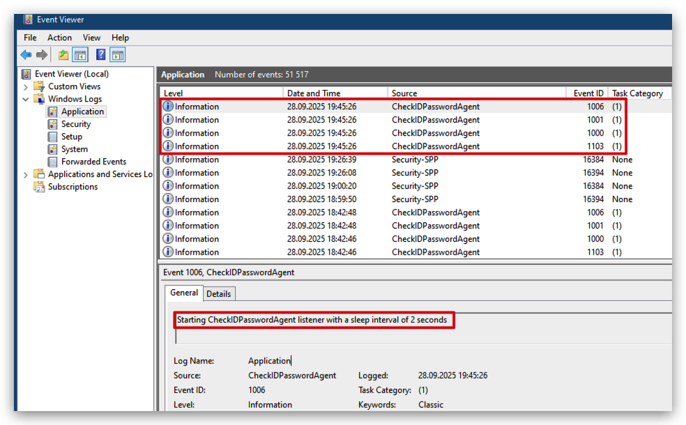

## Step 6 - Create and run the CheckID Agent as a scheduled task

1. As a user with **domain admin** privileges, create a gMSA (group managed service account) for the scheduled task to run as:

    ```PowerShell
    # Remember to include a trailing '$', after computername, if configuring a different (or additional) server principal(s) to retrieve the gMSA password
    New-ADServiceAccount -Name "checkidagent" -PrincipalsAllowedToRetrieveManagedPassword "$($env:COMPUTERNAME)$" -DNSHostname "checkid.no"

    # Verify that the computer can use the group managed service account
    Test-ADServiceAccount -Identity checkidagent -Verbose
    ```

    >**Note!**
    >
    >If the Test-ADServiceAccount is successful it will return ***True***
    >
    >```Test-ADServiceAccount -Identity checkidagent -Verbose```  
    >VERBOSE: Performing the operation "Test" on target "CN=checkidagent,CN=Managed Service Accounts,DC=fabrikam,DC=com".  
    >**True**
    >
    >If the test fails, download script [**Test-gMSAencryptionSettings.ps1**](https://raw.githubusercontent.com/fortytwoservices/powershell/refs/heads/main/checkid/password-agent/Test-gMSAencryptionSettings.ps1), from Fortytwo public GitHub repository, for help with troubleshooting.

1. Assign the gMSA the reset password permission on an organizational unit (OUs) in Active Directory  

    The **PowerShell** way

    1. Download [Delegate-PasswordReset.ps1](https://raw.githubusercontent.com/fortytwoservices/powershell/refs/heads/main/checkid/password-agent/Delegate-PasswordReset.ps1), from Fortytwo public GitHub repository.
    1. Run script as a user with **domain admin** privileges. Provide group managed service account name and distinguished name of where to apply the reset password privilege:  
    ```Delegate-PasswordReset.ps1 -AccountSam "checkidagent$" -DistinguishedName "OU=users,OU=organization,DC=fabrikam,DC=com"```

    Removing the delegated permission can easily be performed in Active Directory Users and Computers:

    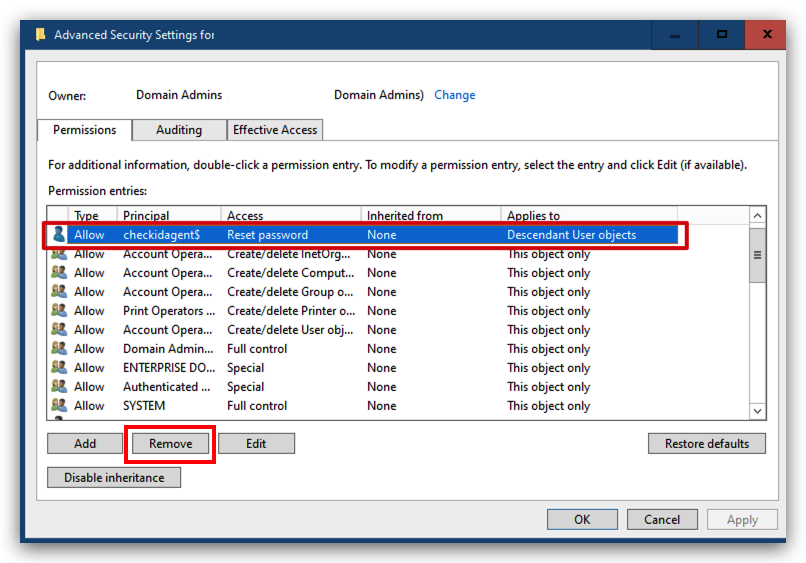

    Using AD tool **dsacls** (see [requirements - AD PowerShell RSAT tools](#requirements))

    1. Run as a user with **domain admin** privileges (adjust the OU path and domain name):

        >**Note**!
        >
        >If running dsacls in a PowerShell 7 shell ***make sure*** there are **single apostrophes** enclosing the final argument.

        ```PowerShell
        # Add Reset Password permission
        dsacls "OU=Users,OU=Organization,DC=FABRIKAM,DC=COM" /I:S /G 'fabrikam.com\checkidagent$:CA;Reset Password;user'
        dsacls "OU=Users,OU=Organization,DC=FABRIKAM,DC=COM" /I:S /G 'fabrikam.com\checkidagent$:rpwp;PwdlastSet;user'
        dsacls "OU=Users,OU=Organization,DC=FABRIKAM,DC=COM" /I:S /G 'fabrikam.com\checkidagent$:rpwp;lockoutTime;user'

        # Verify Reset Password permission
        # Because the gMSA is special account (classified as a machine account) it's sAMAccountName will have a trailing '$', visible from the output
        dsacls "OU=Users,OU=Organization,DC=FABRIKAM,DC=COM" | Select-String -SimpleMatch "checkid"

        Allow FABRIKAM\checkidagent$  Reset Password
        Allow FABRIKAM\checkidagent$  SPECIAL ACCESS for pwdLastSet
        Allow FABRIKAM\checkidagent$  SPECIAL ACCESS for lockoutTime
        ```

        ```powershell
        # Remove permissions assigned to (group managed service) account
        dsacls "OU=Users,OU=Organization,DC=FABRIKAM,DC=COM" /R 'FABRIKAM\checkidagent$'

        # Verify that Reset Password permissions have been removed
        dsacls "OU=Users,OU=Organization,DC=FABRIKAM,DC=COM" | Select-String -SimpleMatch "checkid"
        ```

        >**Note!**
        >
        >*ONLY* when run in with PowerShell 7 the output of Select-String will look like this:
        >
        >Allow FABRIKAM\←[7mcheckid←[0magent$
        >
        >Add **-NoEmphasis** and it will look as expected, as when run with PowerShell 5:
        >
        >Allow FABRIKAM\checkidagent$    Reset Password
        >
        >"*By default, PowerShell 7 highlights the matched string. To turn this off, the -NoEmphasis parameter must be specified.*
        >*Prior versions don't have the built-in capabilities to highlight matched strings.*"

1. Assign permissions to access the **CheckIDAgent** certificate private key

    1. As **administrator**, open ```certlm.msc``` (shortcut for "Manage computer certificates" in Control panel)

    1. Right-click certificate **CheckIDAgent**

    1. Select **Manage Private Keys**  
    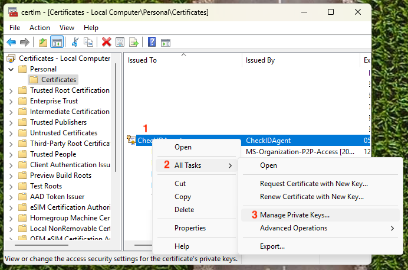

    1. When adding a group managed service account make sure to select "Service accounts"
    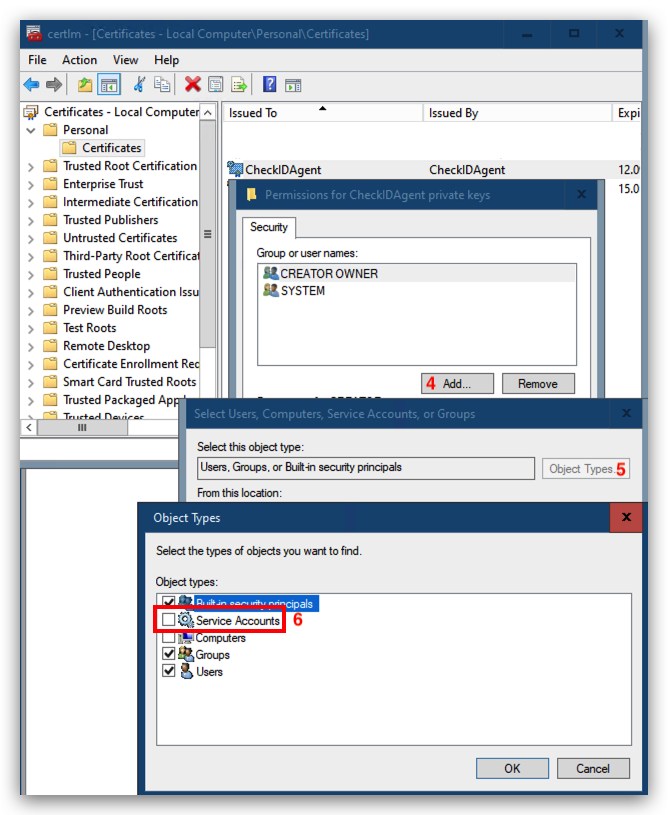

    1. Allow any account that will be running the CheckID Agent **Read** permission to the certificate's private key
    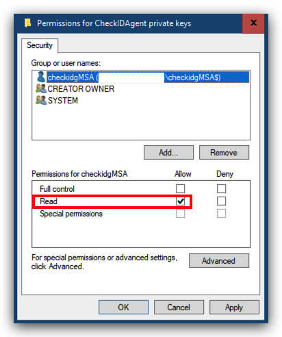

1. For gMSA to run a scheduled task, add the "User Rights Assignment" *Log on as a batch job*

    Using **Local Security Policy** in Administrative Tools

    1. As **administrator**, open ```secpol.msc``` (shortcut for "Local Security Policy")
    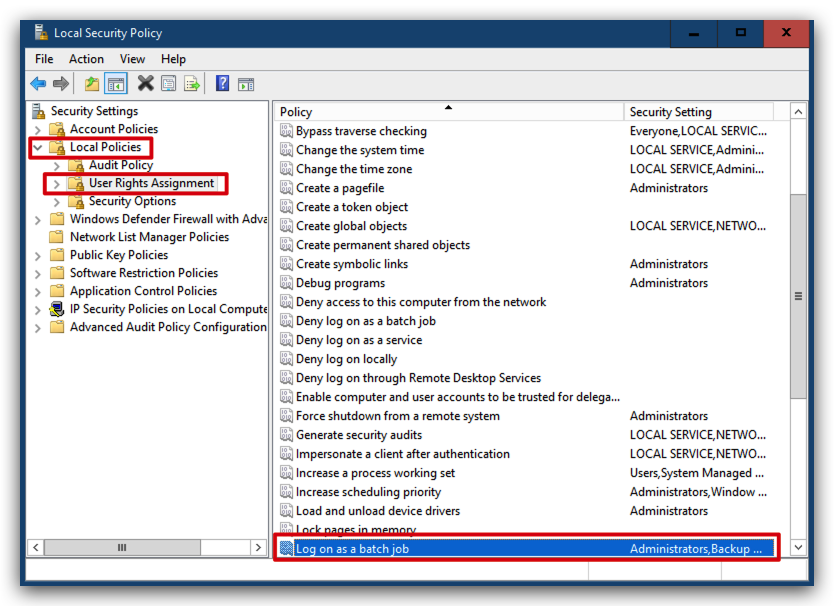

        >**Tip!**
        >
        >Use gpupdate if change isn't effective immediately (if scheduled task won't start):
        >
        >```gpupdate /target:computer /force```

    The **PowerShell** way

   1. Download [Add-LogonAsABatchJobRight.ps1](https://raw.githubusercontent.com/fortytwoservices/powershell/refs/heads/main/checkid/password-agent/Add-LogonAsABatchJobRight.ps1) from Fortytwo public GitHub repository and save it in c:\checkid

   1. Run ```Add-LogonAsABatchJobRight -AccountSam checkidgMSA$```

   1. To remove the permission, run ```Add-LogonAsABatchJobRight -AccountSam checkidgMSA$ -Remove```

1. **RECOMMENDED**  
   To run a scheduled task using a gMSA the scheduled task must be created programmatically

   1. Download [Register-ScheduledTasks.ps1](https://raw.githubusercontent.com/fortytwoservices/powershell/refs/heads/main/checkid/password-agent/Register-ScheduledTasks.ps1) from Fortytwo public GitHub repository and save it in c:\checkid

   1. Download [StartStop-CheckIDAgentListener.ps1](https://raw.githubusercontent.com/fortytwoservices/powershell/refs/heads/main/checkid/password-agent/StartStop-CheckIDAgentListener.ps1) from Fortytwo public GitHub repository and save it in c:\checkid

   1. Configure **StartStop-CheckIDAgentListener.ps1** with configuration from **run.ps1**, which was verified in [Step 5 - Test the Checkid Agent manually](#step-5---test-the-checkid-agent-manually)  
    Use a text editor, open **c:\checkid\run.ps1**, copy and replace the *Add-EntraClientCertificateAccessTokenprofile* and *Connect-CheckIDPasswordAgent* settings placeholder settings in **StartStop-CheckIDAgentListener.ps1** (shown below):

    ```PowerShell
    Add-EntraIDClientCertificateAccessTokenProfile `
        -Resource "2808f963-7bba-4e66-9eee-82d0b178f408" `
        -Thumbprint "<actual thumbprint>" `
        -ClientId "<app registration app id>" `
        -TenantId "<Entra tenant id>"
    
    Connect-CheckIDPasswordAgent `
        -AgentID "<actual agent id>" `
        -Verbose
    ```

    1. Create CheckID Password Agent scheduled task (default gMSA name: **checkidadgent$**, default script path **c:\checkid\StartStop-CheckIDAgentListener.ps1**)

    As **administrator**, open a PowerShell 7 window and run: ```c:\checkid\Register-ScheduledTasks.ps1```  
    To address a different gMSA and run script name / path use:
    ```c:\checkid\Register-ScheduledTasks.ps1 -script c:\checkid\run.ps1 -gMSA checkidgMSA$```
    (remember a trailing $ when using a gMSA)

    >**Tip!**
    >
    >The scheduled task runs the script with parameter **-ExecutionPolicy Bypass** to avoid PowerShell execution policy settings.  
    >For *interactive* script execution, you may need to see **[PowerShell execution policy](#powershell-execution-policy)** to alter effective policy.

1. **OPTIONAL**  
   Create a scheduled task and run it using a (**non**-*managed group*) service account

   1. Runs every 2 minutes (so it will restart the task if it fails)
   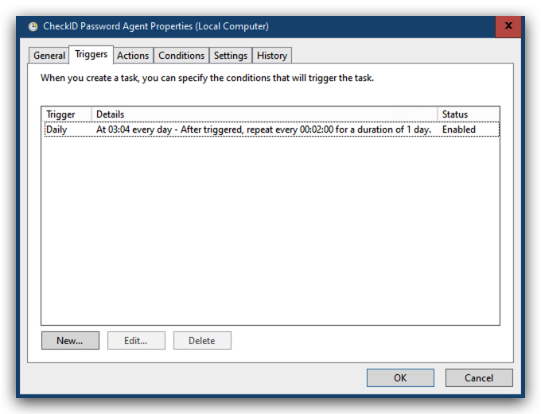

   1. Runs the action ```pwsh -executionPolicy bypass -file c:\checkid\run.ps1```
   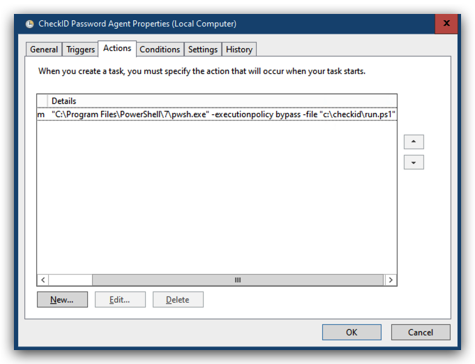

   1. Do not run multiple instances  
   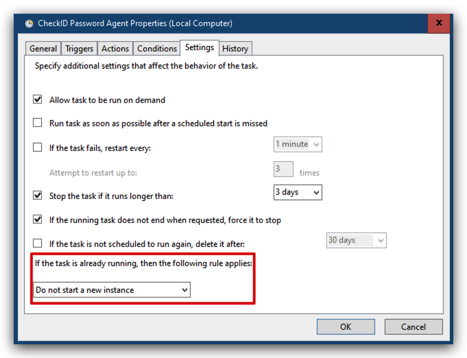

   1. Configure scheduled task to "Run whether user is logged on or not"
   
