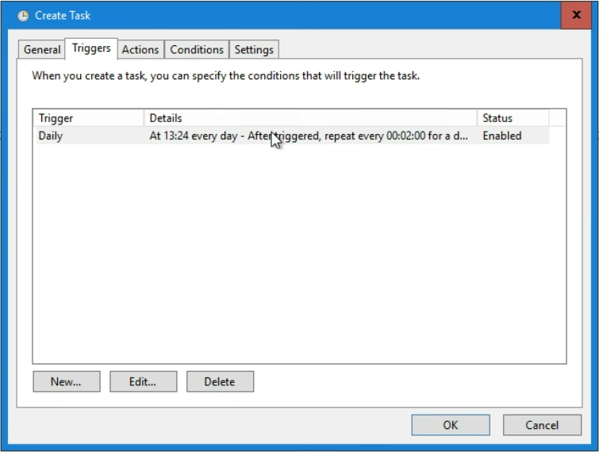

# Password agent installation guide

The Check ID password agent module is a simple module made for listening to change password requests from CheckID, executing the password change in the local Active Directory and reporting back the status of the password change. There are a few steps required to install the module and run it:

## Requirements

- The agent must be running on a domain joined windows server
- [PowerShell 7.5 or newer installed](https://learn.microsoft.com/en-us/powershell/scripting/install/installing-powershell-on-windows#msi)
- AD PowerShell installed (```Install-WindowsFeature -Name RSAT-AD-Tools -IncludeAllSubFeature```)

## Step 1 - Install PowerShell modules

Run the below as administrator in order to install the required modules from PowerShell Gallery:

```PowerShell
Install-Module EntraIDAccessToken -Scope AllUsers
Install-Module Fortytwo.CheckID.PasswordAgent -Scope AllUsers
```

## Step 2 - Configure CheckIDPasswordAgent requirements

Run the following as administrator:

```PowerShell
New-EventLog -LogName "Application" -Source "CheckIDPasswordAgent"
$Certificate = New-SelfSignedCertificate -Subject "CheckIDAgent" -NotAfter (Get-Date).AddYears(100)
[System.Convert]::ToBase64String($Certificate.Export([System.Security.Cryptography.X509Certificates.X509ContentType]::Cert), "InsertLineBreaks") | Set-Content -Path "CheckIDAgent-$($env:COMPUTERNAME).cer"
"","Thumbprint:       $($Certificate.ThumbPrint)", "Certificate file: CheckIDAgent-$($env:COMPUTERNAME).cer","Agent id:         $(New-Guid)","" | Write-Host
```

Open ```certlm.msc```, find the certificate and find **Managed Private Keys**. Allow any account that will be running the CheckID agent **Full access** to the certificate:


> **Note:** The gMSA created in step 6 also needs this permission

## Step 3 - Consent to Fortytwo Universe (Our API) and create app registration for agent

1. As a global administrator, [admin consent to this](https://login.microsoftonline.com/common/adminconsent?client_id=2808f963-7bba-4e66-9eee-82d0b178f408).

2. In **Entra ID**, go to **App registrations** and click **New registration**

3. Give it a name and create **Register**

4. Note down the **Client ID** and **Tenant ID**:


5. Under **Certificates & secrets** upload the certificate file created in Step 2


6. Under **API permissions**, click **Add a permission**, select **APIs my organization uses** and locate **Fortytwo Universe**


7. Under **Application permissions** check **checkid_agent.all** and click *Add permissions**.


8. Click **Grant admin consent**


## Step 4 - Create the run file for the CheckID Agent

Create ```C:\checkid\run.ps1``` with the following contents:

```PowerShell
# Install and auto update the PasswordAgent module
Install-Module Fortytwo.CheckID.PasswordAgent -Confirm:$false -Force -Verbose -Scope CurrentUser
Import-Module Fortytwo.CheckID.PasswordAgent -force

Add-EntraIDClientCertificateAccessTokenProfile `
    -Resource "2808f963-7bba-4e66-9eee-82d0b178f408" `
    -Thumbprint "THUMBPRINT_FROM_STEP2" `
    -ClientId "CLIENT_ID_FROM_STEP3" `
    -TenantId "TENANT_ID_FROM_STEP3"

Connect-CheckIDPasswordAgent `
    -AgentID "AGENTID_FROM_STEP2" `
    -Verbose

Start-CheckIDPasswordAgentListener -Sleep 2 -Verbose -Debug
```

## Step 5 - Try to run the CheckID Agent manually

1. Open a PowerShell and run ```cd c:\checkid ; . c:\checkid\run.ps1```

At this point, you can test out CheckID and see that a password change is received by the agent.

## Step 6 - Run the CheckID agent as a scheduled task

### Create a gMSA for the scheduled task

Run the below PowerShell in order to create a gMSA:

```PowerShell
New-ADServiceAccount -Name "checkidagent" -PrincipalsAllowedToRetrieveManagedPassword "SERVERNAME$" -DNSHostname "checkid.no"
```

### Delegate the gMSA the reset password permission in AD

For each OU where the CheckID agent should be able to reset passwords, run the following three PowerShell lines (with the correct OU path and domain name):

```PowerShell
dsacls "OU=Users,DC=contoso,DC=com" /I:S /G '"contoso.com\checkidagent$:CA;Reset Password";user'
dsacls "OU=Users,DC=contoso,DC=com" /I:S /G '"contoso.com\checkidagent$:rpwp;PwdlastSet";user'
dsacls "OU=Users,DC=contoso,DC=com" /I:S /G '"contoso.com\checkidagent$:rpwp;lockoutTime";user'
```

### Grant permission to certificate

Run **certlm.msc**, locate the **CheckIDAgent** certificate under **Personal** certificates, and **Manage private keys**


Locate the gMSA you created, and grant **Full control**


### Grant permission to Log on as a batch job


### Create scheduled task

3. Create a scheduled task running as the gMSA that:
    - Runs the action ```pwsh``` with the arguments ```-file c:\checkid\run.ps1```
    - Run daily, repeat every 2 minutes (Just in order to restart the task if it fails)
    - Do not run multiple instances




