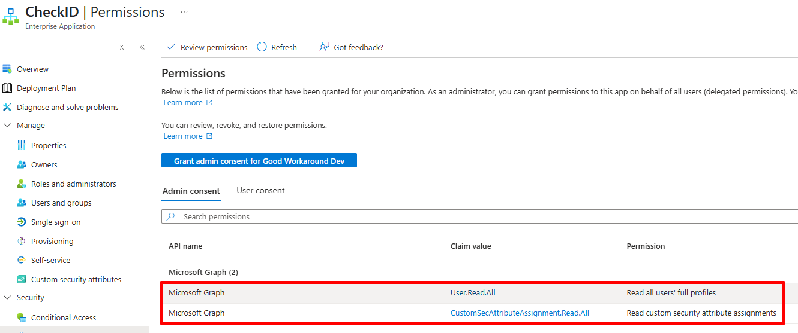
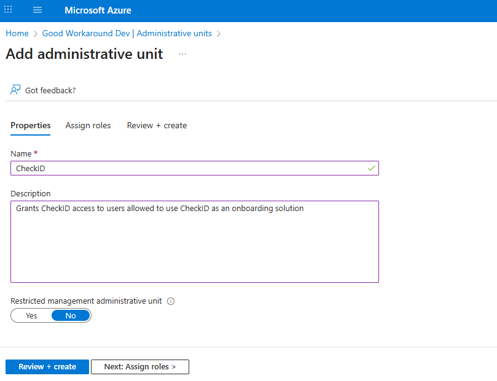
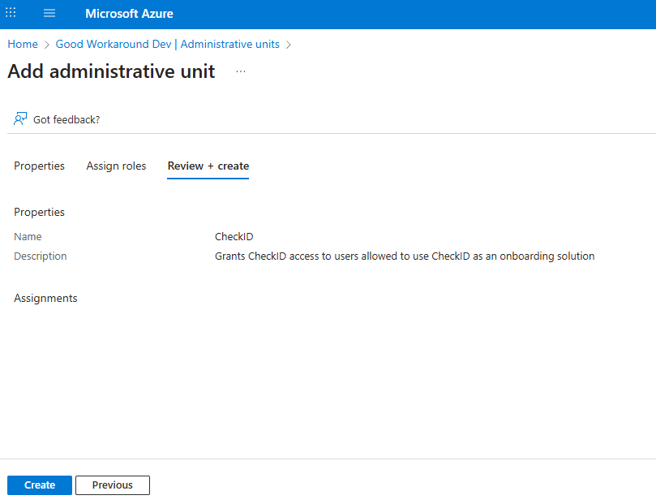
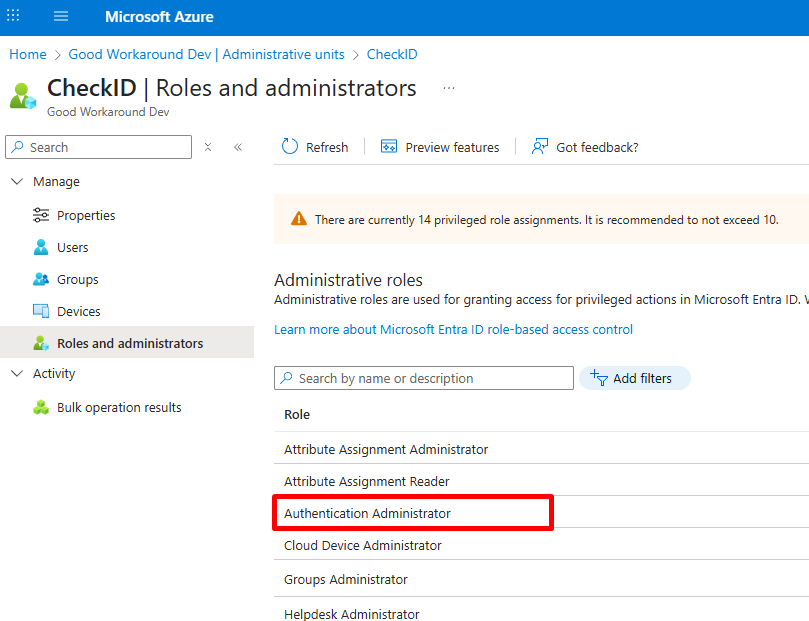
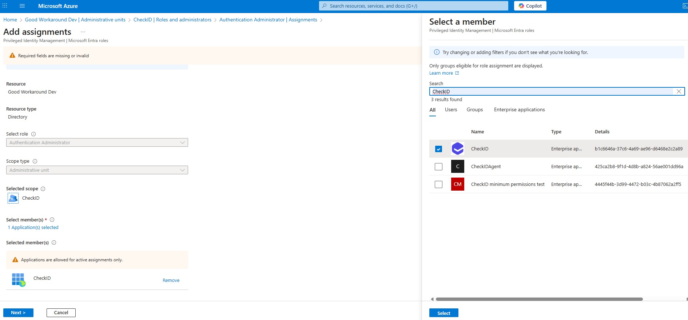
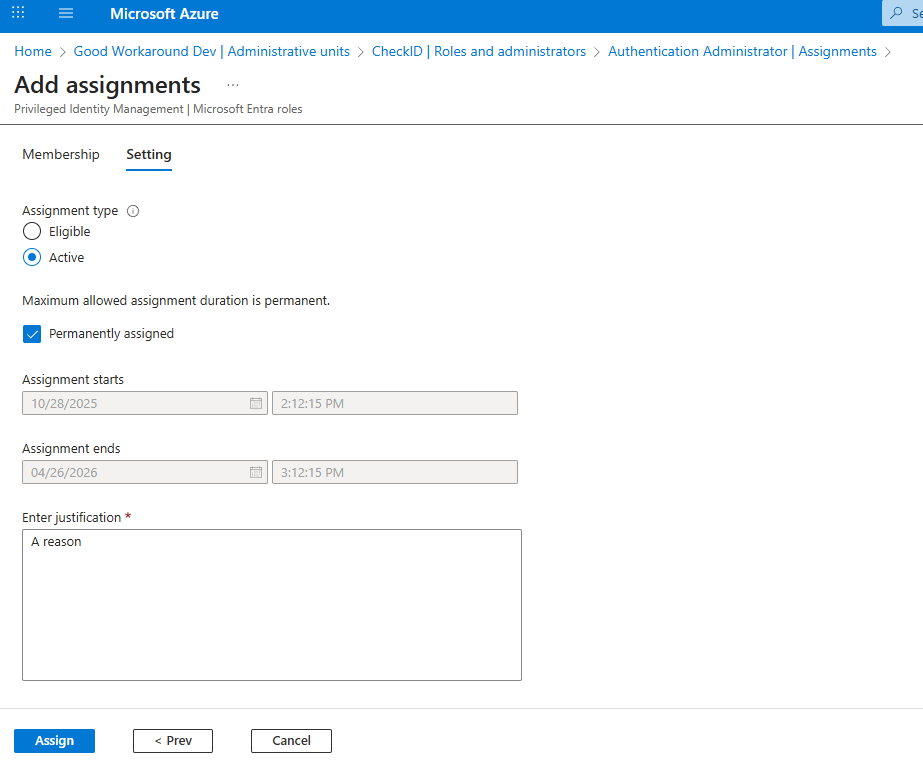
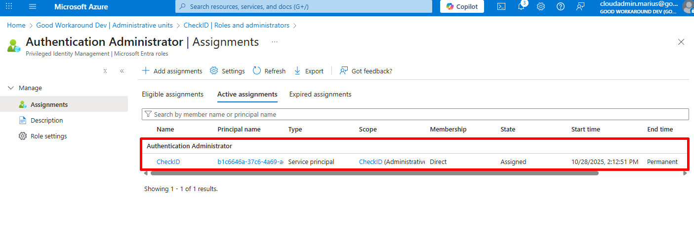

# Configuring minimum permissions

To simplify onboarding of CheckID as much as possible, we request the permission **UserAuthenticationMethod.ReadWrite.All**, which grant access to create a Temporary Access Pass for each user (And also reset other authentication methods).

It is supported to limit the CheckID permissions to the following:

| Permission | Why it’s needed |
|------------|------------------|
| [**User.Read.All**](https://learn.microsoft.com/en-us/graph/permissions-reference#userreadall) | Allows CheckID to locate and read user account details in your tenant |
| [**CustomSecAttributeAssignment.Read.All**](https://learn.microsoft.com/en-us/graph/permissions-reference#customsecattributeassignmentreadall) | Enables CheckID to read custom attribute assignments. This permission has no effect unless the CheckID service principal is explicitly assigned the **Attribute assignment reader** role in Microsoft Entra. |
| [**Authentication Administrator role on an Administrative Unit**](https://learn.microsoft.com/en-us/entra/identity/role-based-access-control/permissions-reference#authentication-administrator) | Grants CheckID access to manage authentication methods for users, but only the members of an administrative unit, instead of all users in your tenant. |

## Step 1 - Add CheckID app and consent

In this situation, you cannot use the default user interface for admin consent. Instead, you need to add the CheckID app using the below PowerShell:

```PowerShell
# Connect your PowerShell session
Connect-MgGraph -Scope Application.ReadWrite.All, AppRoleAssignment.ReadWrite.All

$CheckID = Get-MgServicePrincipal -Filter "AppId eq 'b1c6646a-37c6-4a69-ae96-d6468e2c2a89'"

if(!$CheckID) {
    $CheckID = New-MgServicePrincipal -AppId "b1c6646a-37c6-4a69-ae96-d6468e2c2a89"
    Write-Host "Sleeping 20 seconds for Entra ID to replicate"
    Start-Sleep -Seconds 20
}
$MicrosoftGraph = Get-MgServicePrincipal -Filter "AppId eq '00000003-0000-0000-c000-000000000000'"

# Add permission user.read.all
Invoke-MgGraphRequest -Uri "https://graph.microsoft.com/v1.0/servicePrincipals/$($MicrosoftGraph.id)/appRoleAssignments" -Method POST -Body @{
    principalId = $CheckID.Id
    resourceId = $MicrosoftGraph.id
    appRoleId = "df021288-bdef-4463-88db-98f22de89214"
} | out-null

# Add permission CustomSecAttributeAssignment.Read.All
Invoke-MgGraphRequest -Uri "https://graph.microsoft.com/v1.0/servicePrincipals/$($MicrosoftGraph.id)/appRoleAssignments" -Method POST -Body @{
    principalId = $CheckID.Id
    resourceId = $MicrosoftGraph.id
    appRoleId = "3b37c5a4-1226-493d-bec3-5d6c6b866f3f"
} | out-null
```

At this point, you'll see that CheckID has only two permissions and not currently access to create TAPs:



## Step 2 - Create AU and grant CheckID access

In **Entra ID**, find **Administrative units** and click **+ New administrative unit**.

Name the AU something that makes sense for your environment. Do **not** configure it as a Restricted management administrative unit.



Click **Review + create** (It is not currently possible to grant Service principals access during creation)



Open your administrative unit, go to **Roles and administrators** and click on **Authentication Administrator**:



Locate CheckID as the member:




Input a justificaiton and click **Assign**:



Your environment should now look something like this:



## Step 3 - Custom security attribute access

Following the [Custom Security Attributes part of the guide](./Custom-Security-Attributes.md)

