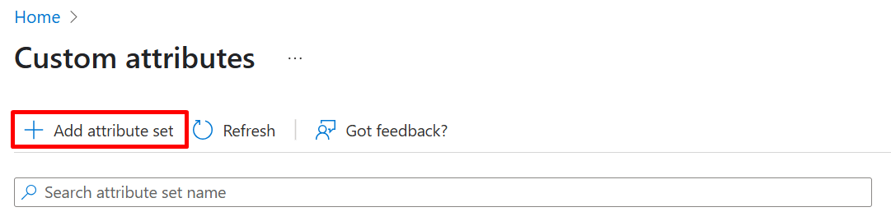
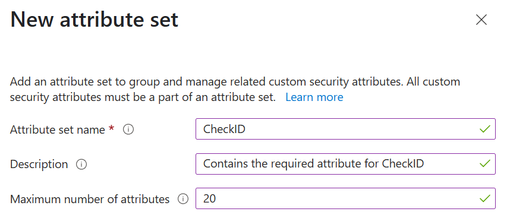
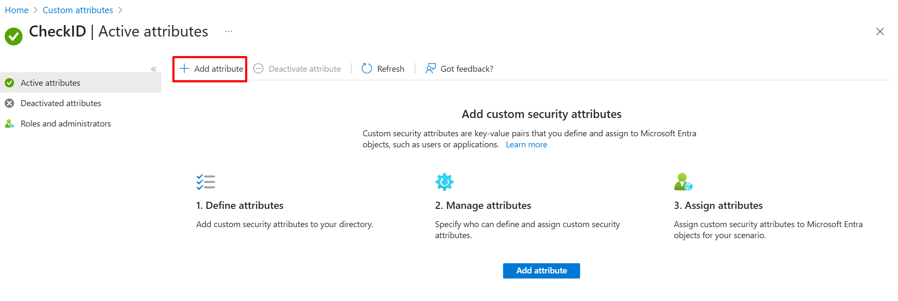
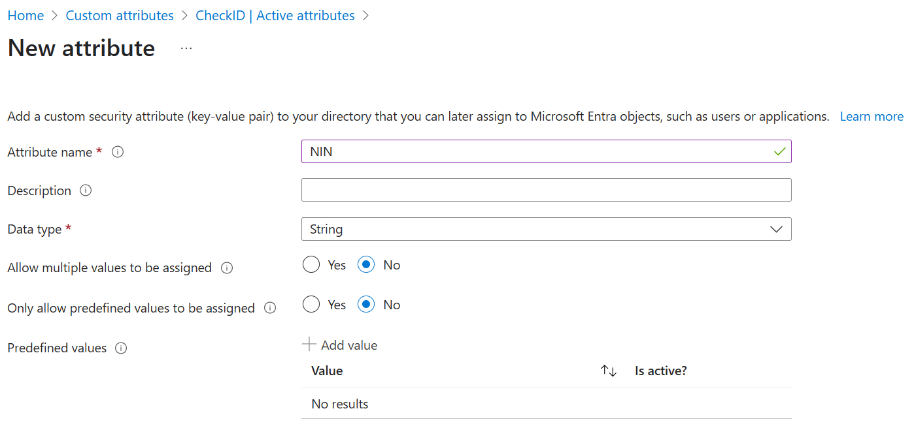
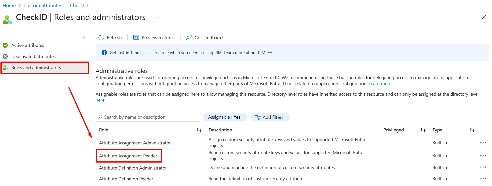
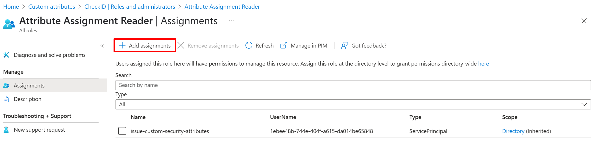
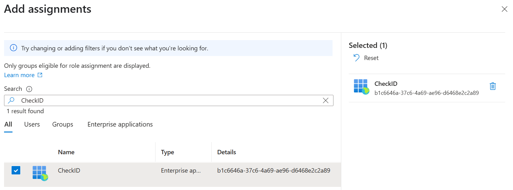

# Custom Security Attributes (CSA)

CheckID uses identity providers such as BankID, ID-porten and similar, which mostly provide national identity numbers (NINs) as the only available information about the signed in user. The sensitivity of these numbers vary between countries, but we always recommend storing these values in Entra ID in [**Custom Security Attributes**](https://learn.microsoft.com/en-us/entra/fundamentals/custom-security-attributes-overview).

Unlike other Entra ID user attributes, CSAs are only readable by users and service principals that have been explicitly granted access.

## Creating the recommended Custom Security Attribute configuration

CheckID can query CSA. This means that if you already have a CSA with the NIN of your users, you can continue using that. However, if you are not currently using CSAs, we recommend you do the following.

1. Grant yourself the **Attribute Definition Administrator** role in Entra ID
2. In the [**Entra portal**](https://entra.microsoft.com), find **Protection** and **Custom security attributes** in the left menu
3. Click **+ Add attribute set**

    

4. Name the attribute set **CheckID** and click **Add**

    

5. Click on the **CheckID** attribute set and **+ Add attribute**

    

6. Name the attribute **NIN** and click **Save**

    

7. Under **Roles and administrators**, click the **Attribute Assignment Reader** role

    

8. Click **+ Add assignments** 

    

9. Find the **CheckID** Enterprise Application and click **Add**

    

## Populating the CSAs

Custom security attributes cannot be synchronized from Active Directory, through Entra ID Connect, like other attributes. Instead, you have some other options that allows you to populate the CSAs with values:

- [Manually set through the Entra portal](https://docs.azure.cn/en-us/entra/identity/users/users-custom-security-attributes?tabs=ms-powershell#assign-custom-security-attributes-to-a-user)
- [Using the Update-MgUser PowerShell cmdlet](https://docs.azure.cn/en-us/entra/identity/users/users-custom-security-attributes?tabs=ms-powershell#assign-a-custom-security-attribute-with-a-string-value-to-a-user)
- [Using the Microsoft Graph](https://learn.microsoft.com/en-us/graph/custom-security-attributes-examples?tabs=http)
- [Using API-Driven Provisioning](https://learn.microsoft.com/en-us/entra/identity/app-provisioning/provision-custom-security-attributes)
- [Using Marius Solbakken's CustomSecurityAttribute sync module in PowerShell](https://www.powershellgallery.com/packages/CustomSecurityAttribute/)

CheckID is built by [Fortytwo](https://fortytwo.io), which have several experts that can help you with populating the CSAs by synchronizing from HR.