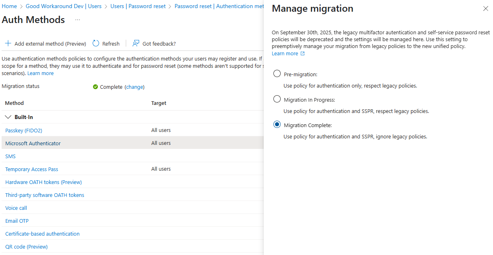
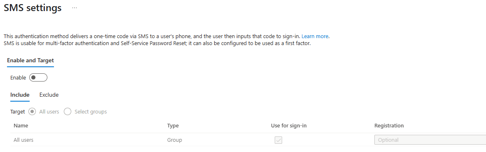
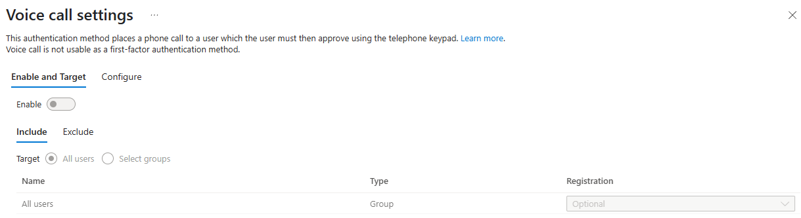
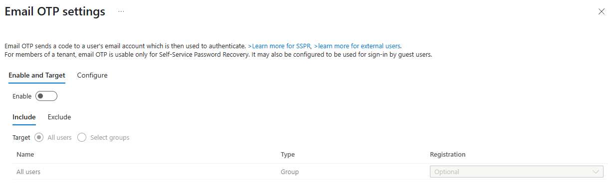
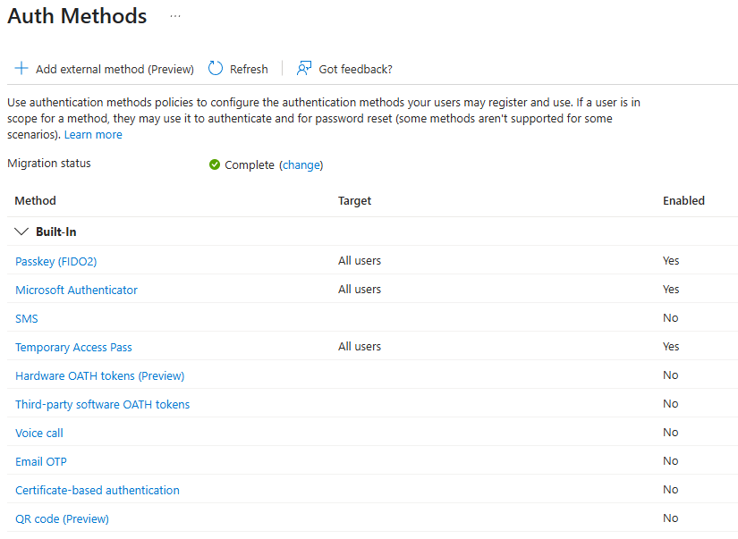

# Password Reset Configuration

As described on the [Getting Started](../Getting-Started.md) pages, CheckID uses the Microsoft self service password reset functionality together with password write-back for allowing users to set a password. The user authenticates with the Microsoft Authenticator app that was onboarded with CheckID:

To allow this configuration, there are some configurations needed in Entra ID, detailed below. This will configure your Entra ID in a very secure fashion, where self service password reset is configured only to be allowed by authenticating using the Microsoft Authenticator app.

## Disable SMS based password reset

> Note: If you are using SMS based sign-in for users, do not follow this step

We recommend disabling SMS based password reset, as it is considered unsecure and will eventually be deprecated by Microsoft.

In the [**Entra portal**](https://entra.microsoft.com/#home), open **Protection** and **Authentication methods**.

Disable the **SMS** method:

## Disable Phone based password reset

We recommend disabling phone based password reset, as it is considered unsecure and will eventually be deprecated by Microsoft.

In the [**Entra portal**](https://entra.microsoft.com/#home), open **Protection** and **Authentication methods**.

Disable the **Voice call** method:

## Disable Email OTP based password reset

We recommend disabling the Email OTP based password reset method, as in general we never see this used at our customers, and we are replacing it with the Microsoft Authenticator app.

Disable the **Email OTP** method:

## Switch authentication methods migration status

Microsoft is moving away from the separate configuration of self service password reset found under **Users** in Entra ID, to the **Authentication methods**. This change will happen in September 2025 (at least as of April 2025). Let's simply switch you over to the new method of configuration.

Make sure you have your methods correctly configured according to the below recommendation:

Switch the **Migration status** to **Complete**.

