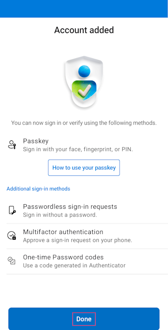
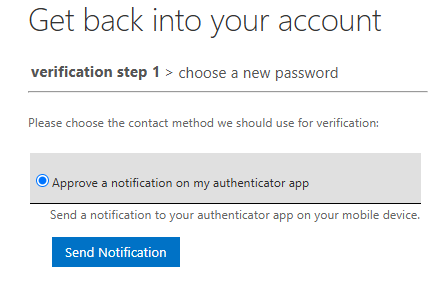

# User Journey with technical details

## Step 1 - User chooses method of authentication

.png)

## Step 2 - Select account to onboard

A value from the authentication session is used to determine which user accounts the person has. These are shown as a list and the user can choose which account to onboard.

.png)

## Step 3 - Install Microsoft Authenticator

The first step that the user needs to do is to install the Microsoft Authenticator app. Here, the url to the Google Play Store and Apple App store is shown. If the user signs in from another device than their phone, the user can show the QR code in order to navigate with those.

At the same time this step is shown, a [Temporary Access Pass (TAP)](https://learn.microsoft.com/en-us/entra/identity/authentication/howto-authentication-temporary-access-pass) is created for the user account. This allows some time for the TAP to be replicated in Entra ID.

.png)

## Step 4 - Sign into Microsoft Authenticator

The user is told to sign into the Microsoft Authenticator app with the userPrincipalName and the generated TAP.

.png)

During this step, when following our [Getting Started guide](../Getting-Started.md), the user will end up with an Authenticator app that both support [notification based MFA](https://learn.microsoft.com/en-us/entra/identity/authentication/concept-authentication-authenticator-app#passwordless-sign-in-via-notifications) and [passkey based MFA](https://learn.microsoft.com/en-us/entra/identity/authentication/concept-authentication-authenticator-app#passkey-sign-in). They will also be told to register their device, if you have configured this policy.:

## Step 5 (OPTIONAL) - Set a password

> NOTE: It is possible to choose whether this step is shown or not. If you do not need passwords, this can be hidden.

The user will told to click the set password button, and that clicking it will open a window with the Entra ID self service password reset functionality. 

When following our [Getting Started guide](../Getting-Started.md), the user will use the already enrolled Microsoft Authenticator app to reset their password.

## Step 6 - More information urls

The user is shown links to where he/she can find more information about being a new hire, etc. These links are customizable and we recommend redirecting the user to an onboarding site on Viva.

.png)

## So what about the computer?

Signing into the computer is the next step, and the phone is now used for this operation - at least when the computer is Entra Joined. For Entra Joined devices, the [Web sign-in for Windows](https://learn.microsoft.com/en-us/windows/security/identity-protection/web-sign-in) is recommended. Here, the user can use the passkey they got in Step 4 for signing passwordlessly into their computer. The computer will then enroll with Windows Hello for Business, which will take over as the users normal method of authentication on that device.

## But we have Macs?

> Note: Documentation not complete yet. We are working on it. In the mean time, have a look at these:

https://learn.microsoft.com/en-us/entra/identity/devices/device-join-microsoft-entra-company-portal?tabs=secure-enclave

https://learn.microsoft.com/en-us/entra/identity/devices/device-join-macos-platform-single-sign-on?tabs=secure-enclave