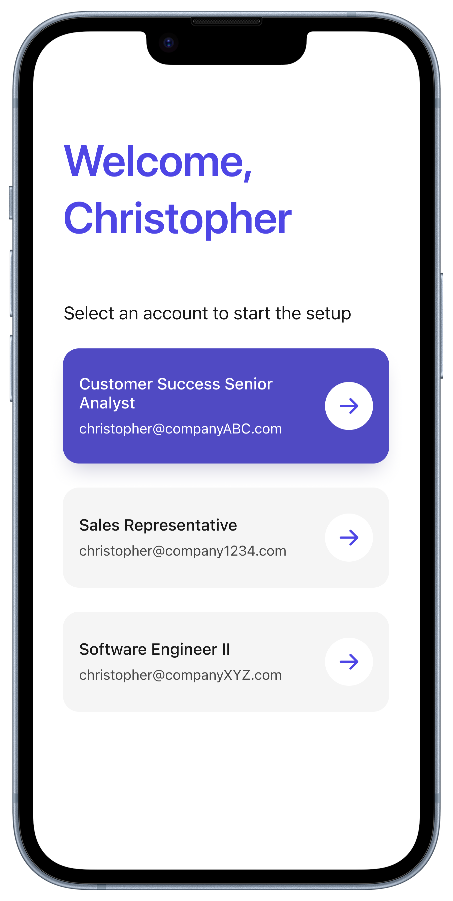
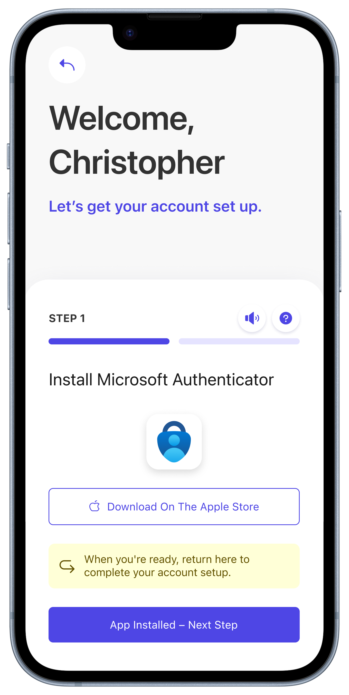
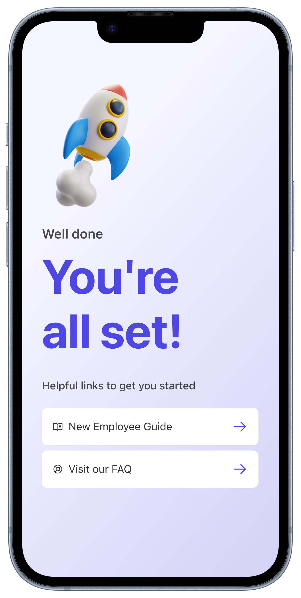

# Example of a user journey when onboarding

Styling, fonts, logo, text etc. are all customizable.

[▶ Watch a demo video](./media/CheckID-Onboarding-Demo-1080.mp4)

| [{ width="100%" }](./media/Step1.png) | [{ width="100%" }](./media/Step2.png) |
|--------------------------------------------------------------------------------------------------|--------------------------------------------------------------------------------------------------|
| Step 1                                                                                           | Step 2                                                                                           |

| [{ width="100%" }](./media/Step3.png) | [{ width="100%" }](./media/Step4.png) |
|--------------------------------------------------------------------------------------------------|--------------------------------------------------------------------------------------------------|
| Step 3                                                                                           | Step 4                                                                                           |

| [{ width="100%" }](./media/Step5.png) | [{ width="100%" }](./media/Step6.png)                                                                 |
|--------------------------------------------------------------------------------------------------|--------------------------------------------------------------------------------------------------|
| Step 5                                                                                           | Step 6                                                                                           |
