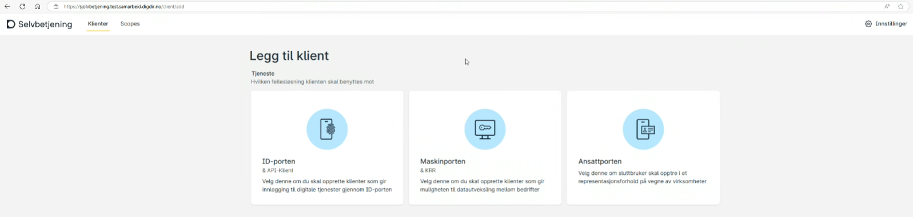
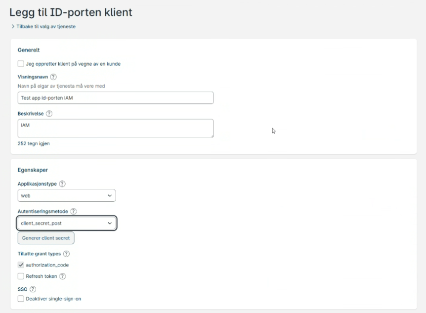
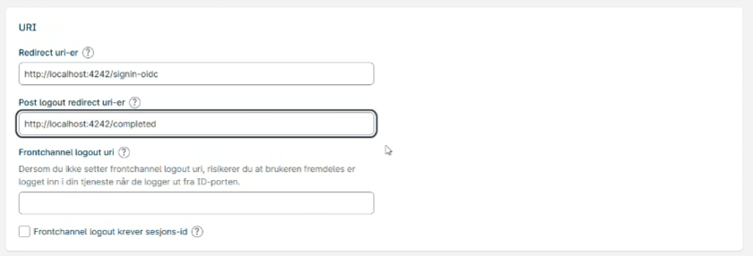

# Configure-ID-porten

> Written in Norwegian, as this is only relevant for Norwegians.

For å sette opp kobling mot ID-porten trenger CheckID en applikasjon registrert i Digidir's Samarbeidsportal. 

## Kortvarianten

Følgende må fylles ut og/eller endres fra standardverdier: 

| Innstilling | Verdi |
|-|-|
| Applikasjonstype | web |
| Autentiseringsmetode | client_secret_post |
| Redirect uri | https://onboarding.din-organisasjon.no/signin-oidc |
| Post logout redirect uri | https://onboarding.din-organisasjon.no/completed |

Det vi trenger tilbake:

- Client id
- Client secret

## Detaljert bruksanvisning

Logg på [Samarbeidsportalen](https://samarbeid.digdir.no/), finn **Selvbetjening** og velg **Legg til klient**.

Navngi applikasjonen **Onboarding** eller noe liknende, og sørg for at egenkaper er konfigurert med Applikasjonstype **Web**, og **client_secret_post**. Per April 2025 så fungerer ikke knappen **Generere client secret** før etter at du har laget applikasjonen, så det gjøres etterpå.

Under **Levetid & tokens** lar du alt stå som standard.

Under **URI** setter du følgende verdi som redirect uri:

https://kundeinstans.checkid.no/signin-oidc,https://onboarding.ditt-selskap.no/signin-oidc

Og følgende som post logout redirect urier:

https://kundeinstans.checkid.no/completed,https://onboarding.ditt-selskap.no/completed

**Lagre klienten**. Etter at klienten er laget kan du opprette client secret ved å trykke **Generer client secret**:

Din CheckID-kontakt har må få oversendt client id og client secret til applikasjonen på en sikker måte.