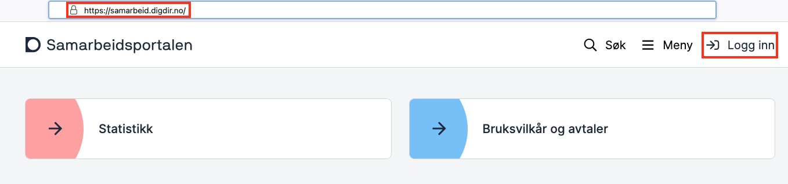
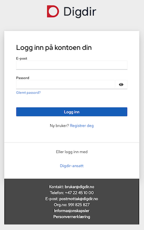
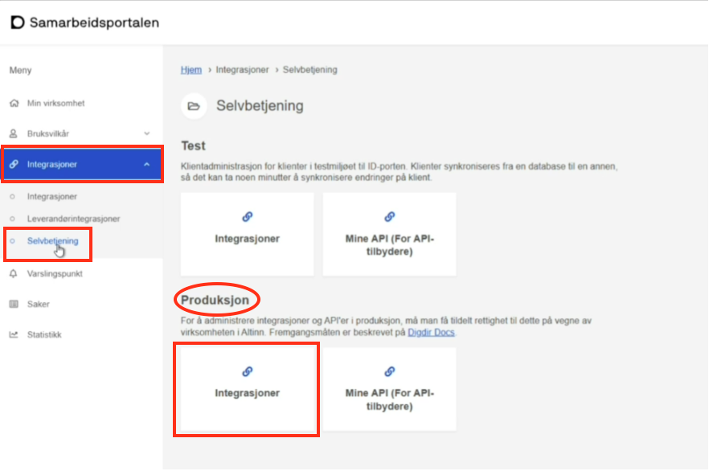
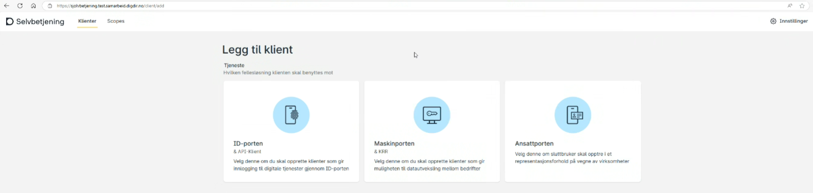
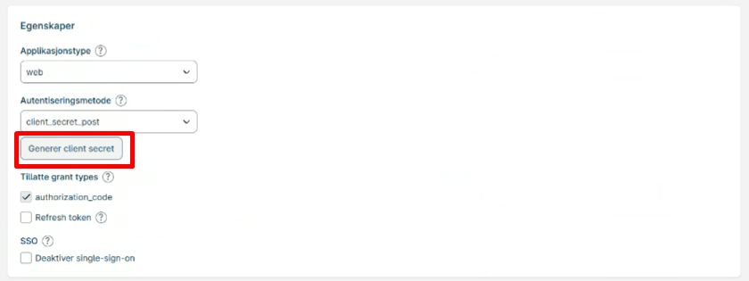
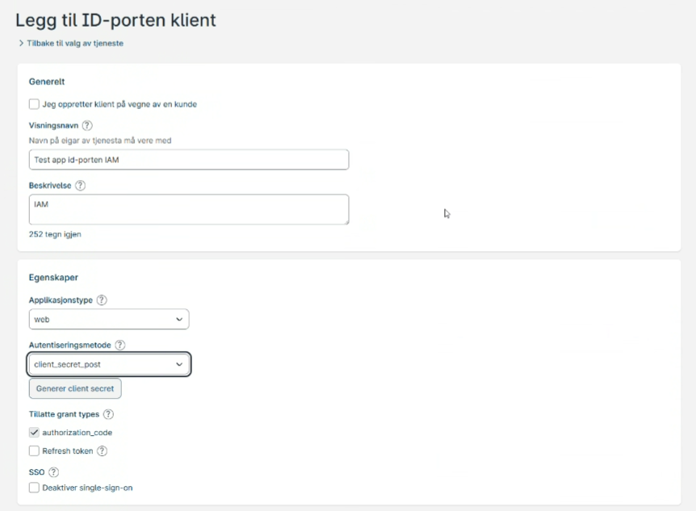
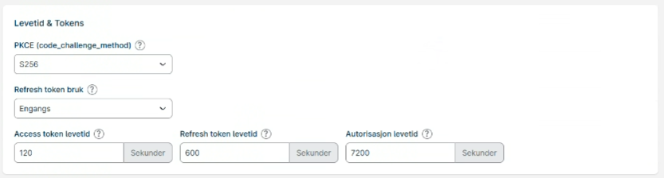
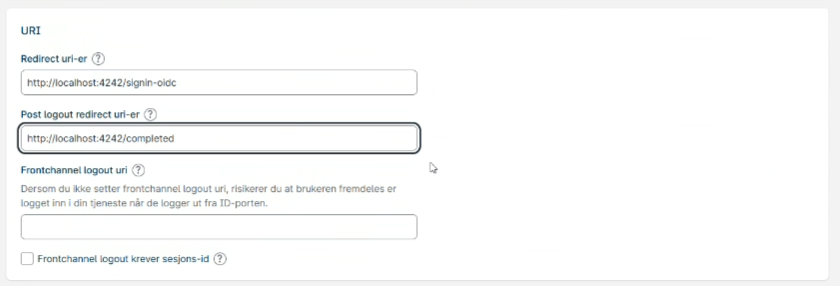
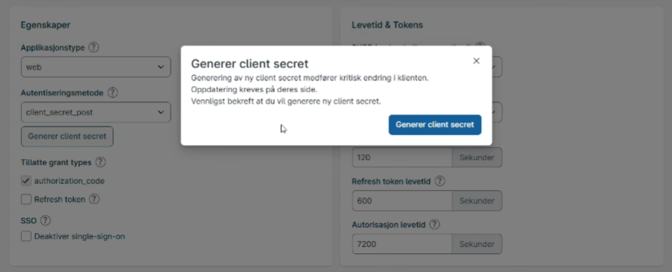

# Configure-ID-porten

> Written in Norwegian, as this is only relevant for Norwegians.

For å sette opp kobling mot ID-porten trenger CheckID en applikasjon registrert i Digitaliseringsdirektoratet sin [Samarbeidsportalen](https://samarbeid.digdir.no/).

## Kortvarianten

Følgende må fylles ut og/eller endres fra standardverdier:

| Innstilling                 | Verdi                                                       |
| --------------------------- | ----------------------------------------------------------- |
| Applikasjonstype            | web                                                         |
| Autentiseringsmetode        | client_secret_post                                          |
| Redirect URI-er             | <https://kundenavn.checkid.no/signin-oidc>                  |
|                             | <https://onboarding.ditt-selskap.no/signin-oidc>            |
| Post logout redirect URI-er | <https://kundenavn.checkid.no/>                             |
|                             | <https://kundenavn.checkid.no/logout>                       |
|                             | <https://kundenavn.checkid.no/logout/idporten-callback>     |
|                             | <https://onboarding.domenenavn.no/>                         |
|                             | <https://onboarding.domenenavn.no/logout>                   |
|                             | <https://onboarding.domenenavn.no/logout/idporten-callback> |                                                         

Det vi trenger tilbake:

- Client id
- Client secret

## Detaljert bruksanvisning

Velg **Logg inn** på [Samarbeidsportalen](https://samarbeid.digdir.no/)

Logg inn med en Digdir konto.

Utvid **Integrasjoner**, velg **Selvbetjening** og deretter miljø.

Velg **Legg til klient**.

Navngi applikasjon, eksempelvis **Onboarding med CheckID**, og benytt følgende konfigurasjon:

| Applikasjonstype | Autentiseringsmetode |
|-|-|
| web| client_secret_post |

>Per april 2025 så fungerer ikke knappen **Generer client secret** før du har laget, og **lagret**, applikasjonen.

>

Under **Levetid & Tokens**, la alt stå som standard.

Under **URI**, tilpass redirect URI-er så det matcher med CheckID bestillingen:

| Redirect URI-er |
|-|
| <https://kundenavn.checkid.no/signin-oidc> |
| <https://onboarding.ditt-selskap.no/signin-oidc> |

| Post logout redirect URI-er |
|-|
| <https://kundenavn.checkid.no/> |
| <https://kundenavn.checkid.no/logout> |
| <https://kundenavn.checkid.no/logout/idporten-callback> |
| <https://onboarding.domenenavn.no/> |
| <https://onboarding.domenenavn.no/logout> |
| <https://onboarding.domenenavn.no/logout/idporten-callback> |

**Lagre klienten**. Etter at klienten er laget kan du opprette client secret ved å trykke **Generer client secret**:

Oversend, på en sikker måte, client id og client secret for applikasjonen til din CheckID-kontakt.
