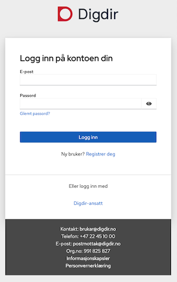

# Configure-ID-porten

> Written in Norwegian, as this is only relevant for Norwegians.

For å sette opp kobling mot ID-porten trenger CheckID en applikasjon registrert i Digitaliseringsdirektoratet sin [Samarbeidsportalen](https://samarbeid.digdir.no/).

## Kortvarianten

Følgende må fylles ut og/eller endres fra standardverdier:

| Innstilling | Verdi |
|-|-|
| Applikasjonstype | web |
| Autentiseringsmetode | client_secret_post |
| Redirect uri-er | <https://kundeinstans.checkid.no/signin-oidc,https://onboarding.ditt-selskap.no/signin-oidc> |
| Post logout redirect uri-er | <https://kundeinstans.checkid.no/completed,https://kundeinstans.checkid.no/,https://kundeinstans.checkid.no/v2/completed,https://onboarding.ditt-selskap.no/completed,https://onboarding.ditt-selskap.no/,https://onboarding.ditt-selskap.no/v2/completed> |

Det vi trenger tilbake:

- Client id
- Client secret

## Detaljert bruksanvisning

Velg **Logg inn** på [Samarbeidsportalen](https://samarbeid.digdir.no/)

Logg inn med en Digdir konto.

Utvid **Integrasjoner**, velg **Selvbetjening** og deretter miljø.

Velg **Legg til klient**.

Navngi applikasjon, eksempelvis **Onboarding med CheckID**, og benytt følgende konfigurasjon:

| Applikasjonstype | Autentiseringsmetode |
|-|-|
| web| client_secret_post |

>Per April 2025 så fungerer ikke knappen **Generer client secret** før du har laget, og **lagret**, applikasjonen.

>

Under **Levetid & Tokens**, la alt stå som standard.

Under **URI**, tilpass redirect uri-er så det matcher med CheckID bestillingen:

>Konfigurer flere uri-er ved å komma-separere dem (xxx,yyy)
>
>Din CheckID-kontakt bistår gjerne med uri-er.

| Redirect uri-er |
|-|
| <https://kundeinstans.checkid.no/signin-oidc,https://onboarding.ditt-selskap.no/signin-oidc> |

| Post logout redirect uri-er |
|-|
| <https://kundeinstans.checkid.no/completed,https://kundeinstans.checkid.no/,https://kundeinstans.checkid.no/v2/completed,https://onboarding.ditt-selskap.no/completed,https://onboarding.ditt-selskap.no/,https://onboarding.ditt-selskap.no/v2/completed> |

**Lagre klienten**. Etter at klienten er laget kan du opprette client secret ved å trykke **Generer client secret**:

Oversend, på en sikker måte, client id og client secret for applikasjonen til din CheckID-kontakt.
