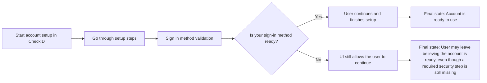
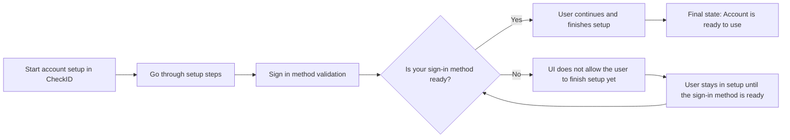

# Account Setup confirms your sign-in method before completion

**Date:** 17th June 2026

Users can now only finish account setup in CheckID once a supported sign-in method is ready on their account. This helps make sure their account is actually ready to use before they leave the setup flow.

## Behaviour before

Users could reach the end of account setup in CheckID before a supported sign-in method was ready on their account. This meant they could leave setup thinking their account was ready to use, even though an important security step was still missing.

## Behaviour after

Users can still go through account setup in CheckID as normal, but they can only finish once a supported sign-in method is ready on their account.

## What this means

- For new users, setup works the same way. Once their sign-in method is ready, they can finish setup and continue.
- For users recovering access to an account, anyone who already has a supported sign-in method will be guided to the right recovery option.

## Why this change was made

This change helps make sure users only finish setup when their account is ready to use and the required security step is in place.
